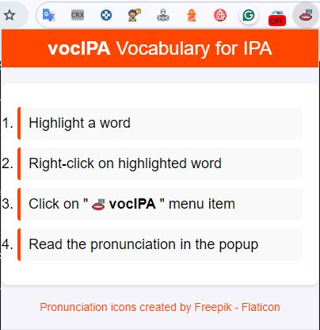
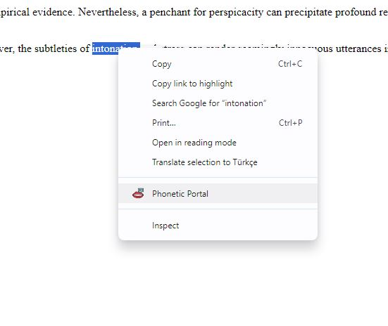
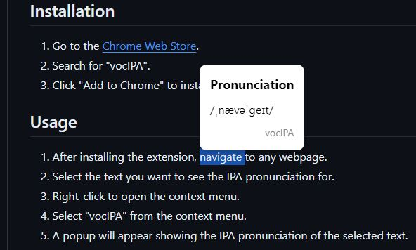

#  vocIPA Chrome Extension

## Overview
The **vocIPA** Chrome extension allows users to view the International Phonetic Alphabet (IPA) pronunciation of selected text on any webpage. This tool is particularly useful for linguists, language learners, and anyone interested in phonetics.

## Features
- Displays IPA pronunciation for selected text.
- Easy-to-use popup interface.
- Lightweight and fast.

## Installation
1. Go to the [Chrome Web Store](https://chrome.google.com/webstore).
2. Search for "vocIPA".
3. Click "Add to Chrome" to install the extension.

## Usage
1. After installing the extension, navigate to any webpage.
2. Select the text you want to see the IPA pronunciation for.
3. Right-click to open the context menu.
4. Select "vocIPA" from the context menu.
5. A popup will appear showing the IPA pronunciation of the selected text.

## Screenshots

## Support
If you encounter any issues or have any questions, please contact us at [caglaror@gmail.com](mailto:caglaror@gmail.com).

## License
This project is licensed under the MIT License - see the LICENSE file for details.

## Acknowledgements
- Thanks to all contributors and users for their support.