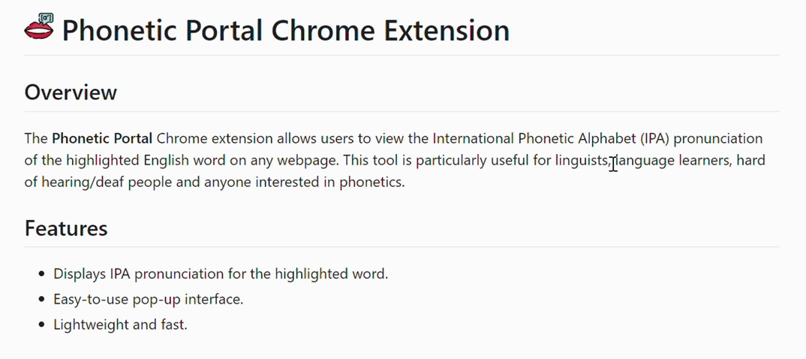
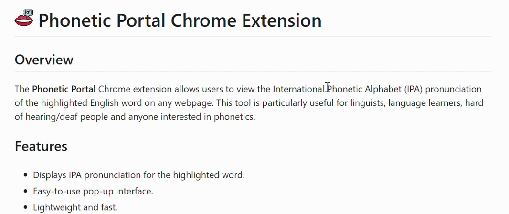

#  Phonetic Portal Chrome Extension

## Overview
The **Phonetic Portal** Chrome extension allows users to view the International Phonetic Alphabet (IPA) pronunciation of the highlighted English word on any webpage. This tool is particularly useful for linguists, language learners, hard of hearing/deaf people and anyone interested in phonetics.

## Features
- Displays IPA pronunciation for the highlighted word.
- Easy-to-use pop-up interface.
- Lightweight and fast.

## Installation
1. Go to the [Chrome Web Store](https://chrome.google.com/webstore).
2. Search for "Phonetic Portal".
3. Click "Add to Chrome" to install the extension.

## Usage
1. After installing the extension, navigate to any webpage.
2. Highlight the word you want to see the IPA pronunciation for.
3. Click the appeared Phonetic Portal menu.
   - Or right-click to open the context menu and select "Phonetic Portal".
4. A portal will appear displaying the IPA pronunciation of the highlighted word.

## Screenshots

## Support
If you encounter any issues or have any questions, please open an issue.

## License
This project is licensed under the BSD 3-Clause License - see the [LICENSE](LICENSE) file for details.

## Acknowledgements
- Thanks to all contributors and users for their support.